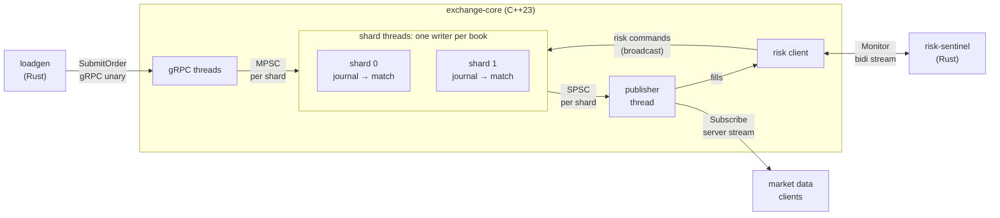

# Lockstep

[](https://github.com/Tomek52/lockstep-exchange/actions/workflows/ci.yml)

**A deterministic, lock-free exchange engine in C++23, with a Rust risk sentinel.
Every state replays in lockstep.**

Lockstep is a small exchange simulator built as an architecture showcase:

- **exchange-core** (C++23) accepts orders over gRPC, matches them per
  instrument with price-time priority, publishes market data, and journals
  every input so that replaying the journal reproduces the exact same state
  and outputs.
- **risk-sentinel** (Rust, tokio + tonic) watches executions over a
  bidirectional gRPC stream, tracks positions and PnL, and pushes risk
  commands back: block a trader, or pull the kill switch.
- **loadgen** (Rust) drives order flow and reports p50/p99/p99.9 latency.

What this repository is meant to demonstrate, in order of importance:

1. **Software architecture.** Hexagonal layers whose dependency rules are
   *enforced by the build*. A single-writer threading model. Deterministic
   replay as a tested property. Every significant decision recorded as an
   [ADR](docs/adr/README.md).
2. **Modern C++ used where it fits.** `std::expected`, `std::flat_map` (with a
   probed fallback), `std::generator`, deducing `this`,
   `std::move_only_function`, `std::print`, ranges, `std::stacktrace`,
   `if consteval` and concepts. Each is used where it removes code or a bug
   class ([ADR-0009](docs/adr/0009-toolchain-baseline-and-feature-fallbacks.md)).
3. **A disciplined workflow for coding with LLMs.** Self-contained task
   specs, tests first, machine-checked guardrails, human review
   ([docs/ai-workflow.md](docs/ai-workflow.md), [CLAUDE.md](CLAUDE.md)).

## Architecture at a glance



- **Single writer per order book.** Instruments are sharded across threads;
  each book is mutated by exactly one thread, so the domain has no locks
  ([ADR-0003](docs/adr/0003-single-writer-sharding.md)).
- **Write-ahead journal per shard.** Commands, including their timestamps and
  the risk commands, are journaled before they are applied, and outputs are
  released only after commit
  ([ADR-0004](docs/adr/0004-deterministic-replay-via-per-shard-journal.md)).
- **Pure domain.** Standard library only: no clocks, threads, I/O or gRPC.
  Checked at configure time (link allow-lists) and test time (include
  fitness functions)
  ([ADR-0002](docs/adr/0002-hexagonal-architecture-enforced-by-the-build.md)).
- **Fixed-point money.** Integer ticks and lots as strong types
  ([ADR-0005](docs/adr/0005-fixed-point-prices-and-quantities.md)).

More: [C4 context](docs/architecture/c4-context.md) ·
[containers and components](docs/architecture/c4-container.md) ·
[threading and data flow](docs/architecture/threading-dataflow.md) ·
[domain model](docs/architecture/domain-model.md).

## Quick start

Requires Ubuntu 24.04 (native, WSL2, or a container). On Windows, clone the
repository inside the WSL filesystem, not under `/mnt/c`.

```bash
scripts/setup-ubuntu.sh                 # ~3 min on a fresh Ubuntu 24.04: GCC 14, Clang 19, gRPC, protobuf, GTest, Benchmark, buf, Rust

# C++: build and test (presets: debug, release, clang-debug, asan-ubsan, tsan)
cmake --workflow --preset debug
cmake --workflow --preset tsan

# Rust
(cd rust && cargo test && cargo build)

# End-to-end: risk-sentinel + exchange-core + loadgen as separate processes
scripts/e2e-smoke.sh

# Or the whole stack in containers
docker compose -f deploy/docker-compose.yml up --build -d --wait
docker compose -f deploy/docker-compose.yml --profile load run --rm loadgen
docker compose -f deploy/docker-compose.yml down
```

Run a service by hand:

```bash
rust/target/debug/risk-sentinel --listen 127.0.0.1:50052
build/debug/exchange-core/main/exchange-core --listen=127.0.0.1:50051 --risk-sentinel=127.0.0.1:50052
rust/target/debug/loadgen --target http://127.0.0.1:50051 --count 100 --instrument 2
```

## Repository layout

```
proto/lockstep/v1/        gRPC contracts shared by both builds (buf-linted)
exchange-core/
  domain/                 pure business logic: types, order book, shard engine
  concurrency/            queue concepts, lock-free queues, idle strategies
  app/                    ports + runtime (Engine, ShardRuntime, Publisher, replay)
  adapters/{grpc,codec,journal,risk_client}/
  main/                   composition root
  tests/<layer>/          one test executable per layer + architecture rules
  bench/  fuzz/
rust/crates/{lockstep-proto,risk-sentinel,lockstep-loadgen}/
deploy/                   Dockerfiles, docker-compose.yml
scripts/                  setup, format, clang-tidy, proto and docs checks, e2e
docs/{architecture,adr,tasks}/, docs/ai-workflow.md
CLAUDE.md                 rules for AI agents in this repo
ROADMAP.md                milestones → task specs
```

## Project status

**Milestone M0 (walking skeleton) is complete.** What works today:

| Area | Status |
|---|---|
| Build: CMake presets (debug, release, clang-debug, asan-ubsan, tsan), feature probe, architecture rules | ✅ |
| CI: C++ on 5 presets, clang-tidy, fuzzing, Rust, proto checks, e2e, Docker | ✅ all 11 jobs green on GitHub Actions |
| Contracts: `lockstep.v1` protos, codegen in CMake and `build.rs` | ✅ |
| Domain: strong types, validation, pooled order book with O(1) cancel, price-time matching, modify (cancel/replace), duplicate client order id rejection, and risk controls (block, kill switch, link policy) | ✅ |
| Runtime: shards + publisher on `std::jthread`, write-ahead ordering, lossless shutdown | ✅ lock-free SPSC egress ([task 005](docs/tasks/005-spsc-queue.md)) and MPSC ingress ([task 006](docs/tasks/006-mpsc-queue.md)); threads park on a `Doorbell` instead of polling, with runtime stats exposed ([task 007](docs/tasks/007-runtime-idle-and-stats.md)); runtime subscriptions with filtering and a slow-consumer policy ([task 011](docs/tasks/011-publisher-fanout.md)) |
| Order entry over gRPC, end to end | ✅ |
| Risk session handshake + inbound risk commands | ✅ (reports, acks, reconnect: task 014) |
| Write-ahead journal on disk: one file per shard, CRC32C-checked records, `--journal-dir`, `--fsync=none\|commit` | ✅ writer ([task 008](docs/tasks/008-journal-writer.md)); reader and recovery: task 009 |
| Deterministic replay test (live vs replay, in memory) | ✅ (file-based replay: task 010) |
| Market data stream | ⏳ task 013 |
| risk-sentinel position/limit engine | ⏳ tasks 015–016 |

Verified locally on the skeleton (WSL2, Ubuntu 24.04):
- all C++ tests on debug, clang-debug, asan-ubsan and tsan;
- clang-tidy clean;
- cargo fmt, clippy (`-D warnings`) and tests;
- buf lint;
- the e2e smoke test;
- the compose stack (200/200 orders accepted).

GitHub Actions: all 11 jobs passed on the first run after publishing (run 36348820151).

## Benchmark results

*Placeholder, to be filled by [task 018](docs/tasks/018-benchmarks.md) from the `release` preset.*

| Benchmark | p50 | p99 | p99.9 |
|---|---|---|---|
| price level upsert/erase, `flat_map` vs `std::map` | – | – | – |
| matching: aggressive fill | – | – | – |
| SPSC / MPSC queue round trip | – | – | – |
| engine submit → completion (in-process) | – | – | – |

## Documentation

- [Architecture](docs/architecture/README.md): C4 diagrams, threading,
  domain model.
- [Architecture Decision Records](docs/adr/README.md).
- [Task backlog](docs/tasks/README.md) and [roadmap](ROADMAP.md).
- [AI-assisted workflow](docs/ai-workflow.md) and the agent rules in
  [CLAUDE.md](CLAUDE.md).

The same documents render as a searchable site (MkDocs + Material, with
Mermaid diagrams). Cross-references point at stable, versioned anchors, and
`scripts/docs-check.sh` fails on any broken link or superseded anchor
([ADR-0015](docs/adr/0015-documentation-site-and-versioned-anchors.md)):

```bash
python3 -m venv .venv-docs && .venv-docs/bin/pip install -r requirements-docs.txt
.venv-docs/bin/mkdocs serve          # http://127.0.0.1:8000
scripts/docs-check.sh                # anchors + mkdocs build --strict
```

## License

[MIT](LICENSE)
