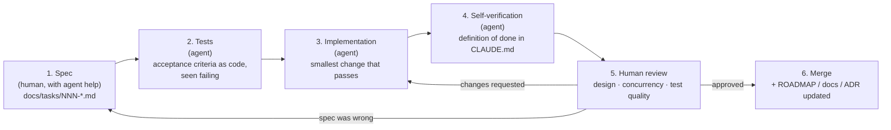

# Working with LLM coding agents

This repository is built by one human engineer working with LLM coding agents.
The goal is not to produce code faster at any cost. It is to keep every
change **reviewable, verifiable and attributable**, so that the final system
is something a senior engineer would sign off on.

## Principles

1. **The human owns the architecture; agents own implementation within it.**
   Boundaries, trade-offs and priorities are decided by a person and written
   down (ADRs, task specs, [CLAUDE.md](../CLAUDE.md)) before an agent starts.
2. **Specs are contracts.** A task spec is self-contained: goal, context,
   interfaces, acceptance tests, files, out-of-scope items and dependencies.
   The agent sees only the repository, never the conversation that produced
   the spec.
3. **Tests before implementation.** Acceptance tests are written first and
   observed failing, so an implementation cannot redefine "correct" after
   the fact.
4. **Machines check what they can; humans review what they can't.**
   Architecture rules, sanitizers, fuzzers and determinism tests catch whole
   classes of LLM mistakes automatically. Human review concentrates on
   design, concurrency reasoning, and whether the tests test the right thing.
5. **Claims require evidence.** "It builds and the tests pass" means the
   commands were run and their output is in the PR. A check that could not be
   run is reported as not run.

## The loop



### 1. Spec

- Write or refine `docs/tasks/NNN-*.md` using the fixed structure (see
  [docs/tasks/README.md](tasks/README.md)).
- Acceptance criteria are **observable and specific**: "sweeps three levels
  best-first and emits trades at 100, 101, 102", not "matching works".
- Link the ADRs that constrain the task. If the task requires a new
  decision, the spec says so and the deliverables include the ADR.
- Declare file ownership and dependencies, so parallel agents do not collide.

### 2. Tests first

- The agent turns acceptance criteria into tests and runs them, expecting
  them to fail.
- The failing output goes into the PR or commit description.
- A test that passes before the implementation exists is testing the wrong
  thing.

### 3. Implementation

- The smallest change that makes the tests pass while respecting CLAUDE.md.
- No scope creep. Anything worth doing that is not in the spec becomes a
  note, or a new task spec, in the PR description.

### 4. Self-verification

- The agent walks through the definition of done in CLAUDE.md and reports
  each item with the command it ran.
- Anything it could not run (for example Docker, or a missing tool) is
  stated plainly.

### 5. Human review

Use this checklist for LLM-authored changes. These are the failure modes
seen most often:

| Look for | Why it matters |
|---|---|
| **Tests weakened to pass**: assertions removed, tolerances widened, expected values copied from actual output | The most common way a wrong implementation "passes" |
| **Plausible-but-wrong concurrency**: orderings without a stated pairing, `relaxed` that should be `acquire`, a missing wake-up argument | TSan only catches races that actually happen in the run |
| **Invented APIs or features**: library functions that don't exist in *our* toolchain, or flags a tool doesn't have | The FeatureProbe and CI catch some; reviewers catch the rest |
| **Hidden nondeterminism**: a clock read, `unordered_map` iteration feeding output, a random seed | Breaks ADR-0004 silently until a replay diverges |
| **Boundary erosion**: "just one include", or logic placed in an adapter because it was easier there | Architecture tests catch includes, not misplaced logic |
| **Unverified claims**: "tested with TSan" without output | Principle 5 |
| **Silent scope creep**: refactors riding along with a feature | Harder to review; hides regressions |
| **Over-mocking**: tests that assert the mock was called rather than behaviour | Tests pass while the system is broken |

### 6. Merge and record

- Tick the task in [ROADMAP.md](../ROADMAP.md).
- Update architecture docs and README status if they changed.
- If review uncovered an LLM error worth remembering, add it to
  **Lessons learned** below.

## Guardrails built into the repository

| Guardrail | Catches | Where |
|---|---|---|
| Link allow-lists (configure time) | a layer linking something it must not | `cmake/ArchitectureRules.cmake` |
| Include fitness functions, plus a self-test fixture | forbidden headers per layer | `exchange-core/tests/architecture/` |
| `static_assert`s on types and constexpr logic | unit mix-ups, format drift | domain and journal tests |
| Determinism test (live vs replay) | hidden inputs, nondeterministic output | `exchange-core/tests/determinism/` |
| ThreadSanitizer preset (mandatory in CI) | data races in the concurrent core | `CMakePresets.json`, CI |
| ASan + UBSan + libFuzzer | memory errors, UB on untrusted input | `asan-ubsan` preset, `exchange-core/fuzz/` |
| clang-tidy (warnings as errors) and clippy pedantic | bug patterns, style drift | `.clang-tidy`, `rust/Cargo.toml` |
| `buf lint` / `buf breaking` | contract drift across languages | `scripts/check-proto.sh` |
| Cross-process e2e smoke | wiring that only fails between processes | `scripts/e2e-smoke.sh` |
| FeatureProbe | toolchain assumptions | `cmake/FeatureProbe.cmake` |

## Agents and skills

The loop above is encoded as Claude Code subagents (`.claude/agents/`) and
skills (`.claude/skills/`), so every session plays the same roles the same
way. Agents run in their own context. The reviewing agents get no Write or
Edit tool; they keep Bash to build and test, so "never modify files" is an
instruction for them, not a hard limit. The same holds for the `docs/`-only
rule of the analyst and architect.

| Loop step | Agent | Model | Write/Edit tools | Skill (slash command) |
|---|---|---|---|---|
| 1. Spec | `analyst` | Opus 5.5 | yes, `docs/` only by instruction | `/write-task-spec <description>` |
| 1. Spec: a new decision | `architect` | Opus 5.5 | yes, `docs/` only by instruction | `/new-adr <title>` |
| 2–3. Tests, implementation | `developer` | Sonnet 5 | yes | `/implement-task <NNN>` drives steps 2–6 |
| 4. Self-verification | `verifier` | Sonnet 5 | no | `/definition-of-done` (`run-dod.sh`) |
| 5. Review | `code-guard` | Opus 5.5 | no | `/guard-review [PR \| branch]` |
| 5. Review: concurrency | `concurrency-auditor` | Opus 5.5 | no | added by `/guard-review` for threaded code |
| PR upkeep | – | – | – | `steward`: CI job ↔ local command, known failure causes |
| Docs: a versioned anchor was bumped | – | – | yes | `/docs-sync [base]` (`.claude/commands/`): re-checks every reference to the changed item ([ADR-0015](adr/0015-documentation-site-and-versioned-anchors.md#adr0015-version-bump-rule-v1)) |

Models: Opus 5.5 where the work is judgment (writing a spec, weighing a
decision, finding what is wrong in plausible code); Sonnet 5 where it is
volume or procedure (implementing a precise spec, running the checks). The
developer and its reviewers deliberately run on different models, so a
blind spot of one is less likely to pass the other.

Context budget ([ADR-0016](adr/0016-agent-context-budget.md)): every agent
starts with an empty context and pays for whatever enters it on every later
turn. CLAUDE.md is loaded into each agent automatically, so no instruction
asks for it to be read again. Build and test output stays in log files
(`quick-check.sh` for the inner loop, `run-dod.sh` for the definition of
done), and only the verdict and the errors reach the agent. The
documentation rules live in `.claude/rules/documentation.md` and load when
an agent reads a documentation file. Review findings go back to the same
`developer` agent with `SendMessage` rather than to a fresh one.

Rules for changing them: an agent's instructions may only point to
CLAUDE.md, `.claude/rules/`, ADRs and this document, never restate a rule
differently. When a rule changes, change it at its source and check the
agents still agree.

## Prompt template for executing a task

```text
You are implementing docs/tasks/NNN-<name>.md in this repository.
1. Read CLAUDE.md, the task spec, and every ADR the spec links. Do not start
   coding until you have.
2. Write the acceptance tests from the spec first. Build and run them; show
   me they fail and why.
3. Implement the smallest change that makes them pass without violating
   CLAUDE.md section 1. Stay within "Files expected to change"; if you must
   touch another file, explain why.
4. Run the full definition of done (CLAUDE.md section 4) and report each item
   with the exact command and its result. Say explicitly what you could not
   run.
5. Commit in small Conventional Commits. Do not push.
If the spec is ambiguous or wrong, stop and ask instead of guessing.
```

## How this repository was bootstrapped

The skeleton was produced by an LLM agent (Claude) in two phases. First, a
written plan: the directory tree, target graph, proto sketch, threading
design, ADR list and backlog. A human reviewed and approved it. Then the
build-out, with verification after every step:
- every commit that touches C++ or CMake was checked out into a clean git
  worktree, built with the `debug` preset and had its tests run;
- the final tree passed all five presets (debug, release, clang-debug,
  asan-ubsan, tsan), clang-tidy, clippy, `buf breaking` (including a
  deliberate negative test), the e2e smoke test, and the Docker Compose stack;
- the setup script was timed in a fresh `ubuntu:24.04` container.

The GitHub Actions workflow, linted locally with actionlint, then passed all
11 jobs on its first run on GitHub. The commit history shows the order in which things were built.
An independent review pass before finishing found several statements in the
docs that went beyond the evidence; they were corrected, which is the
workflow above working as intended.

## Lessons learned

<!--
Record cases where LLM output was wrong and how it was caught. One entry per
case, newest first:

### YYYY-MM-DD: short title
- **Task / context:**
- **What the agent produced:**
- **Why it was wrong:**
- **How it was caught:** (test, sanitizer, review, CI job, ...)
- **What changed so it can't recur:** (new test, CLAUDE.md rule, ADR, lint)
-->
