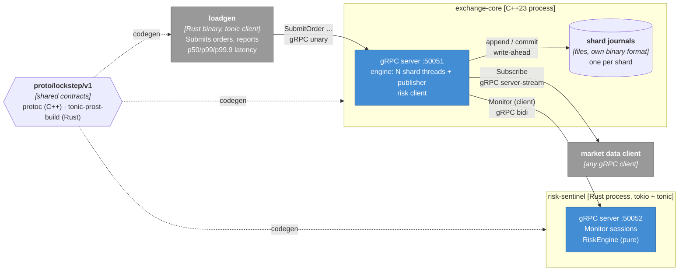
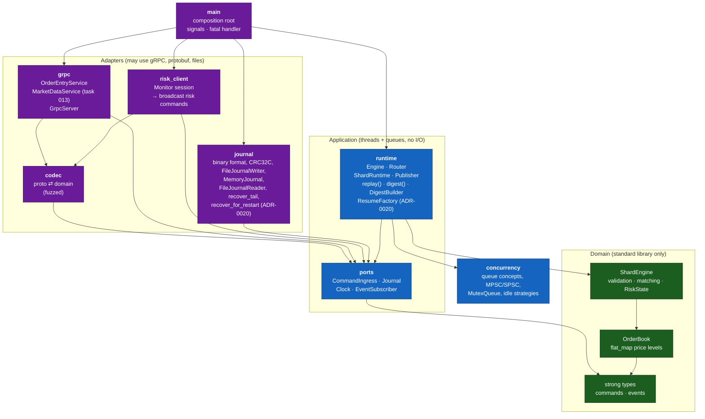

# C4 level 2: containers (and level 3 for exchange-core)

## Containers

Deployment: [`deploy/docker-compose.yml`](../../deploy/docker-compose.yml) runs
`risk-sentinel`, then `exchange-core` (once the sentinel is healthy), with
`loadgen` behind the `load` profile.

## Components of exchange-core (hexagonal layout)

Arrows are compile-time dependencies. They all point inward, and the build
enforces that ([ADR-0002](../adr/0002-hexagonal-architecture-enforced-by-the-build.md)).

| Component | CMake target | May link | Enforced by |
|---|---|---|---|
| domain | `lockstep::domain` | nothing | link allow-list + std-header allow-list |
| concurrency | `lockstep::concurrency` | Threads | link allow-list + include rule |
| app | `lockstep::app` | domain, concurrency | link allow-list + include rule |
| journal | `lockstep::journal` | app | link allow-list + include rule |
| codec | `lockstep::codec` | app, generated `lockstep::proto` | review |
| grpc | `lockstep::adapter_grpc` | app, codec, gRPC | review |
| risk_client | `lockstep::adapter_risk` | app, codec, gRPC | review |
| main | `exchange-core` | everything | – |

**Startup / restart (ADR-0020, task 010).** Before `main` builds the
`Engine`, it checks `--journal-dir` for a consistent set of shard journals
(`validate_journal_dir`: no stray file for a shard id past `shard_count`, no
partial set), then for each shard whose journal already exists:
`recover_tail` cuts a torn tail, a header-validated `read_journal` reads it
back (`recover_for_restart`), and the recovered records replay into that
shard's engine via `Engine`'s `ResumeFactory` *before* any shard thread
starts - not published, only state rebuild. The shard then reopens the same
file to append (`FileJournalWriter::open_for_append`) and resumes sequence
numbering where it stopped. A refused or inconsistent journal fails startup
naming the file; nothing is deleted or truncated automatically. Right after
`Engine::start()`, and before the gRPC server or risk client can reach it,
each shard journals `RiskLinkStatus{connected=false}` as this run's own
first command, so a resumed "link was up" state from before a crash cannot
let `RiskLinkPolicy::FailClosed` treat the link as live with nothing
connected.

**lockstep-replay** (a separate `main` binary, not shown above) reads a
journal directory the same way, with the same `Router::round_robin`
assignment, and prints each shard's digest (`app::digest`, built on
`DigestBuilder`) for offline verification; `--print-digest-on-exit` prints
the equivalent from the live run's own `DigestBuilder` instead of re-reading
the journal, so the two can be compared without one trivially reproducing
the other.
