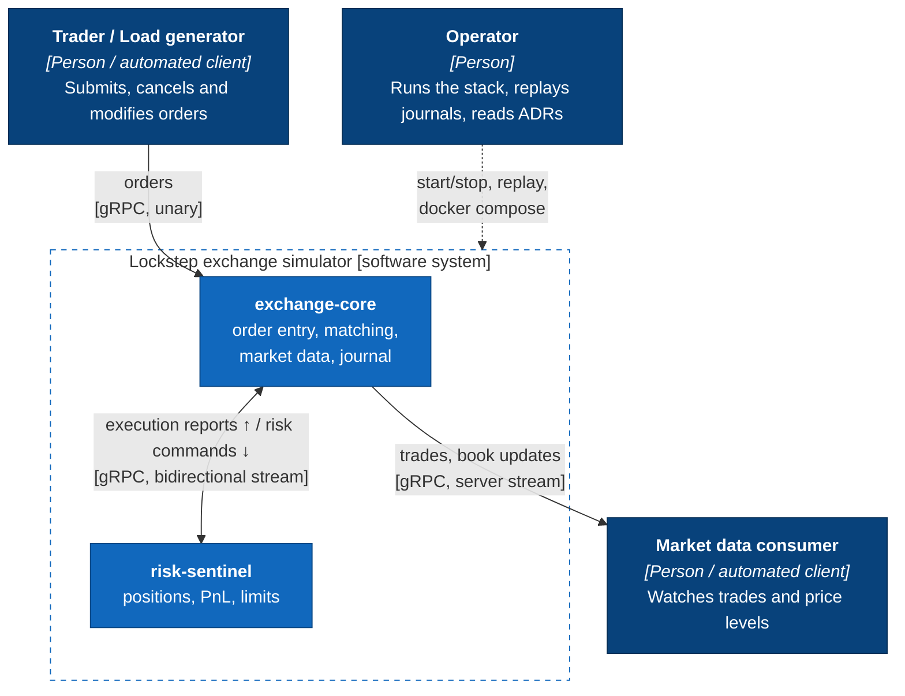

# C4 level 1: system context

## Scope

| In scope | Out of scope |
|---|---|
| Continuous limit order book per instrument, price-time priority | Auctions, circuit breakers, iceberg/stop orders |
| Limit (GTC/IOC), market, cancel, modify | Authentication, entitlements, TLS |
| Post-trade risk loop with block/kill switch | Clearing, settlement, margining |
| Deterministic replay from a journal | Multi-node replication / failover |

## External interfaces

All interfaces are defined once in [`proto/lockstep/v1`](../../proto/lockstep/v1):

- `OrderEntryService`: unary `SubmitOrder` / `CancelOrder` / `ModifyOrder`
  returning a `CommandAck` stamped with `(shard_id, shard_sequence)`.
- `MarketDataService.Subscribe`: server stream of trades, level updates and
  instrument status, one event per message, public data only
  ([task 013](../tasks/013-grpc-market-data.md)).
- `RiskSentinelService.Monitor`: the bidirectional risk session
  ([ADR-0013](../adr/0013-risk-feedback-loop.md)).
