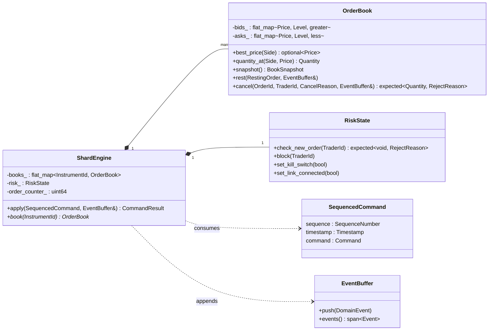

# Domain model

Code: [`exchange-core/domain/include/lockstep/domain`](../../exchange-core/domain/include/lockstep/domain).
Everything here is standard-library-only C++23 with no threads, clocks, I/O
or randomness ([ADR-0002](../adr/0002-hexagonal-architecture-enforced-by-the-build.md)).

## Value types

All identifiers and quantities are distinct strong types
(`StrongInt<Tag, Rep>`). Arithmetic is opt-in through the `Additive` mixin,
which uses deducing `this`, so `Price + Quantity` and `OrderId + OrderId` do
not compile.

| Type | Rep | Notes |
|---|---|---|
| `Price` | `int64` ticks | fixed point ([ADR-0005](../adr/0005-fixed-point-prices-and-quantities.md)); additive |
| `Quantity` | `uint64` lots | additive |
| `OrderId` | `uint64` | top 16 bits = shard id, low 48 bits = per-shard counter |
| `ClientOrderId`, `TraderId` | `uint64` | |
| `InstrumentId`, `ShardId` | `uint32` | |
| `SequenceNumber` | `uint64` | per shard, starts at 1 |
| `Timestamp` | `int64` ns | an **input**, stamped by the shard runtime |
| `RiskCommandId` | `uint64` | idempotency key from the sentinel |

## Commands (inputs)

`Command = std::variant<NewOrder, CancelOrder, ModifyOrder, BlockTrader,
UnblockTrader, KillSwitch, RiskLinkStatus>`. Each alternative has a stable
`CommandTag`, the value the journal stores
([ADR-0012](../adr/0012-journal-binary-format.md)).

## Events (outputs)

`Event = std::variant<OrderAccepted, OrderCancelled, OrderModified, Trade,
BookLevelChanged, InstrumentStatusChanged, RiskCommandApplied>`. The
`DomainEvent` concept requires an alternative of `Event` that is trivially
copyable and tagged with an `EventKind`. Events travel through queues by
plain copy.

## Rejections

`RejectReason` values are returned via
`std::expected<CommandOutcome, RejectReason>`. The domain never throws
([ADR-0008](../adr/0008-error-handling-strategy.md)). Validation is `constexpr`,
and its boundary cases are `static_assert`ed.

## Matching rules (target behaviour, tasks 001–004)

- **Price-time priority.** Better price first; at equal price, earlier
  sequence first.
- **Trade price.** The resting (maker) order's price.
- **Limit GTC:** the remainder rests. **Limit IOC and market:** the
  remainder is cancelled (`CancelReason::ImmediateOrCancel`).
- **Modify.** Reducing quantity at the same price keeps priority. A price
  change or quantity increase loses priority (cancel/replace).
- **Self-trade.** Allowed in v1 (documented simplification).
- **Blocked trader.** New orders are rejected and resting orders cancelled.
  **Kill switch:** every instrument is halted and resting orders cancelled.

## The determinism contract

> For a given `ShardConfig`, the sequence of `(CommandResult, events)` produced
> by `ShardEngine::apply` is a pure function of the sequence of
> `SequencedCommand`s.

Checked by `tests/determinism/replay_determinism_test.cpp`: a live
multi-threaded run is compared with a single-threaded `app::replay()` of each
shard's journal.
