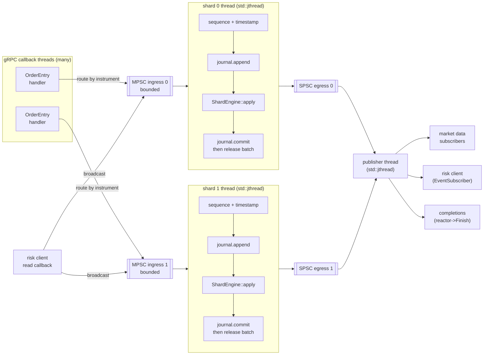
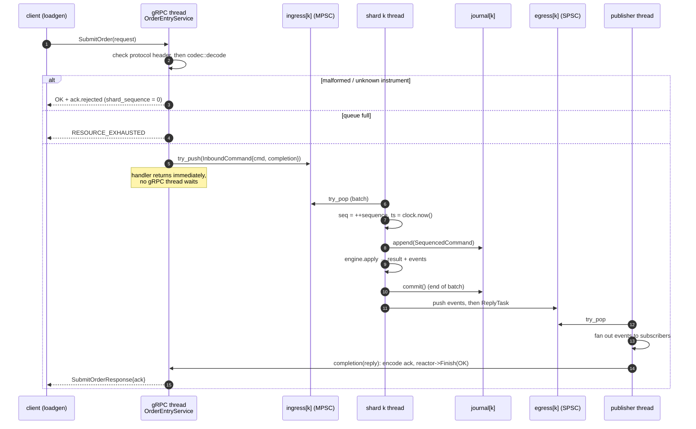
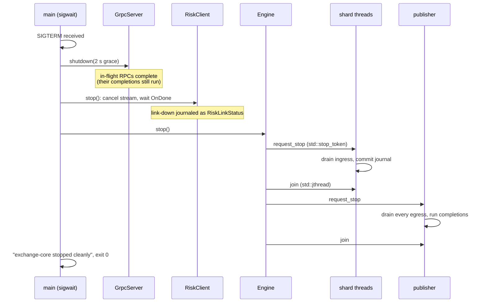

# Threading and data flow

The runtime follows the single-writer principle ([ADR-0003](../adr/0003-single-writer-sharding.md)):
every order book has exactly one thread that ever touches it, so the domain
needs no locks. Threads talk only through bounded queues
([ADR-0011](../adr/0011-lock-free-queues-and-memory-ordering.md)).

## Threads and queues

| Thread | Owns (sole writer) | Reads from | Writes to |
|---|---|---|---|
| gRPC callback threads | nothing | network | shard ingress (MPSC) |
| risk client callbacks | nothing | Monitor stream | every shard ingress (broadcast) |
| shard *k* | `ShardEngine` *k* (books, risk state), journal *k*, sequence counter | ingress *k* | egress *k* (SPSC) |
| publisher | subscriber buffers | all egress queues | subscribers, completions |

## Life of an order

The ack is never sent before the command is journaled: outputs are released
only after `commit()` ([ADR-0004](../adr/0004-deterministic-replay-via-per-shard-journal.md)).

## Shutdown protocol

Lossless shutdown requires stopping producers before consumers:

Signals are blocked in every thread (`pthread_sigmask` before any thread
starts) and consumed synchronously by `sigwait` in `main`. No asynchronous
signal handler ever runs concurrently with the runtime.

## Memory-ordering map

| Atomic | Location | Ordering | Why |
|---|---|---|---|
| `Engine::accepting_` | `app/src/engine.cpp` | relaxed | Admission hint only; producers are stopped before `stop()` |
| `ManualClock::next_` | `app/ports/clock.hpp` | relaxed | Only uniqueness of values matters |
| fatal handler pointer | `app/src/fatal.cpp` | relaxed | Function pointer, no associated data |
| `RiskClient::established_` | `adapters/risk_client` | release / acquire | Publishes the accept handler's effects |
| SPSC `head_`/`tail_` | task 005 | acquire/release pairs | See ADR-0011 |
| MPSC slot sequences, `enqueue_pos_` | task 006 | acquire/release + relaxed CAS | See ADR-0011 |
