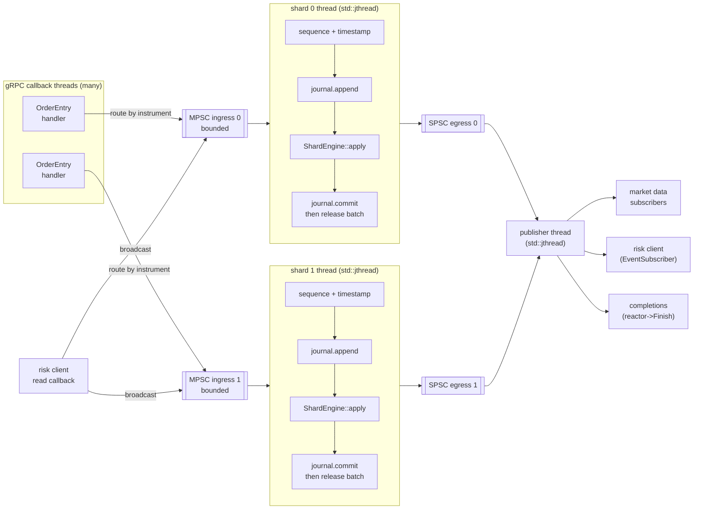
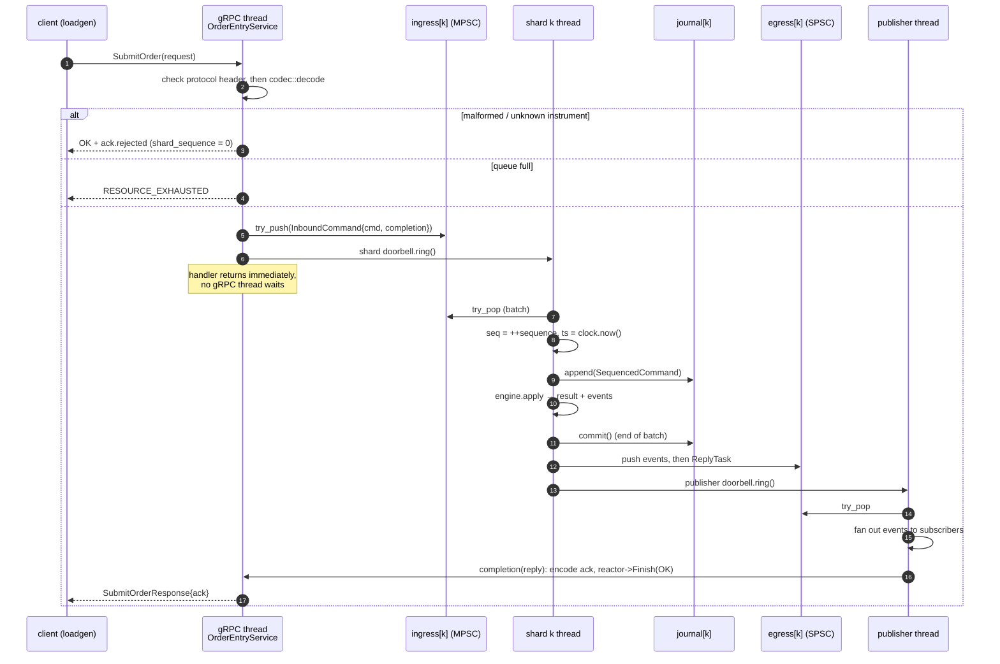
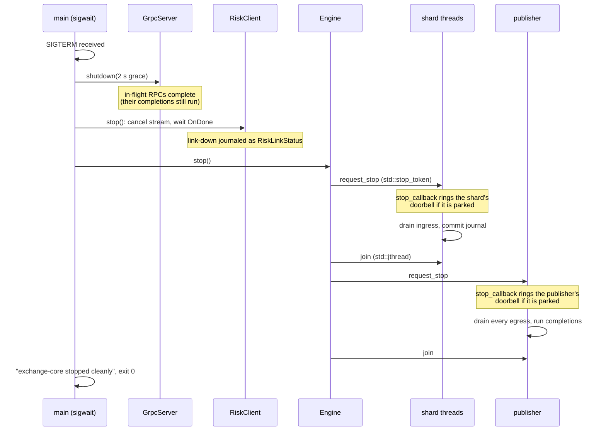

# Threading and data flow

The runtime follows the single-writer principle ([ADR-0003](../adr/0003-single-writer-sharding.md)):
every order book has exactly one thread that ever touches it, so the domain
needs no locks. Threads talk only through bounded queues
([ADR-0011](../adr/0011-lock-free-queues-and-memory-ordering.md)).

## Threads and queues

| Thread | Owns (sole writer) | Reads from | Writes to |
|---|---|---|---|
| gRPC callback threads | nothing | network | shard ingress (MPSC) |
| risk client callbacks | nothing | Monitor stream | every shard ingress (broadcast) |
| shard *k* | `ShardEngine` *k* (books, risk state), journal *k*, sequence counter | ingress *k* | egress *k* (SPSC) |
| publisher | `subscriptions_` list, `Subscription` control queue | all egress queues, subscription control queue (MPSC) | `EventSubscriber`s, `Subscription` rings, completions |

### Runtime subscriptions (task 011)

`Engine::subscribe(filter, capacity)` lets any thread register a
`Subscription` while the engine is running - a bounded, per-consumer SPSC
ring plus a `SubscriptionFilter` (instruments, and trades/book-updates/
private-events flags; `InstrumentStatusChanged` is gated only by the
instrument filter, never by the three booleans). Registration cannot touch
`subscriptions_` directly from the calling thread (that list is the
publisher's alone, same single-writer rule as everything else here), so
`subscribe()` hands the new `Subscription` to the publisher thread through a
small bounded MPSC control queue, rings its doorbell, and then **blocks**
(a spin, never a park) until the publisher thread has actually drained and
acknowledged it (`Subscription::is_registered()`) before returning it to
the caller. That wait is usually within one publisher iteration, but can be
longer if another producer is preempted mid-push (see below) - it is not
bounded. `subscribe()` must never be called from the publisher thread
itself (e.g. from inside a completion or an `on_ready()` hook) - nothing
else would ever drive that acknowledgement, so it can never make progress.
That specific case is treated as an invariant violation rather than a wait:
`Publisher` records its own thread's id at the start of `run()` and
`subscribe()` calls `fatal()` immediately if it is ever called from that
same thread, instead of spinning forever.

That block is required, not just a convenience: `control_` is a
multi-producer queue with the stall property documented in
`concurrency/mpsc_queue.hpp` - a producer preempted between claiming a slot
and publishing it can make every later slot, including a *different*
subscribe() call's own already-published one, unreachable to `try_pop()`
for an unbounded time. No placement of the publisher's drain call closes
that by itself; only acknowledging the specific registration does. Once
acknowledged, nothing the caller does afterwards (e.g. submitting a
command) can have happened before that point, which is what makes "a
command submitted after `subscribe()` returns is always delivered in full"
hold regardless of exactly when the publisher thread happens to process the
registration.

Before the publisher thread has ever called `run()`, there is nothing to
send the request to and wait on - blocking there would deadlock a caller
that does `engine.subscribe(...); engine.start();` on one thread (wiring up
a subscriber before opening the engine to traffic). `subscribe()` instead
registers directly (on the calling thread) in that case, under a mutex that
also guards the one-time transition `run()` makes at its very start: any
subscribe() call already holding that mutex, or that acquires it first,
finishes registering directly before `run()` is allowed past that point;
any call that acquires it afterwards sees the transition already made and
takes the normal control-queue-and-acknowledgement path instead. Either
way, `subscriptions_` still only ever has the one writer ADR-0003 requires.
This also covers `Engine::stop()` called without a preceding `start()`: with
no `run()` ever having executed, that one-time transition never happens
either, so every `subscribe()` call still takes the direct-registration path
above rather than reaching the (never-set) shutdown flag it would otherwise
wait on - and `Engine::stop()` itself closes whatever was registered that
way and marks the path closed, so a `subscribe()` racing or following that
`stop()` gets back an already-closed `Subscription` rather than one that
looks live but will never receive anything.

This mutex (`pre_start_mutex_`) is the app layer's only lock, and it is
off the hot path by construction, not by convention: every shard and the
publisher's own steady-state loop never touch it - only `subscribe()`'s
pre-start branch and the one-time flip at the very top of `run()` do.
ADR-0003's "no locks" rule is about that steady-state path (the domain and
the per-shard runtime loops), not about a one-time startup handshake.

`ShardRuntime::release_staged()` pushes one command's events to egress with
a separate `try_push()` per event, not as one atomic unit, so the
publisher's `try_pop()` can see "nothing more right now" partway through a
command and the rest only once the shard catches up - a subscription that
registered in that gap must receive either *all* of that command's events
or *none*, never just the tail. Every `PublishedEvent` carries its
command's per-shard `sequence`, so the publisher tracks
`last_sequence_[shard]` (the sequence of the last item popped so far for
that shard) and stamps it onto every newly registered `Subscription` as
`start_sequence_` at the moment of registration; `Subscription::wants()`
only ever delivers events whose sequence is strictly later. Because one
command's events all share its sequence number, that threshold can never
admit part of a command while excluding the rest: either the whole command
postdates the stamp (none of it had been popped when this subscription
registered - delivered in full) or none of it does (some of it had already
been popped - none of it is delivered, including the part not yet popped).

A subscriber that stops polling fills its ring; the publisher never blocks
on it (ADR-0006's slow-consumer policy). The moment a push to a
subscription's ring fails, that `Subscription` is marked `overflowed()`
(no further events are delivered to it) and its `on_ready()` hook, if any,
fires once; the publisher drops it from `subscriptions_` on its next
`poll_once()` iteration (`prune_subscriptions()`, once per call - cheap
enough, and this cleanup is not latency-sensitive the way registration
ordering is). `cancel()` additionally waits out any `on_ready()` invocation
already in progress (a short spin, never a park) before returning, so a
consumer may safely destroy whatever its hook captured right after
`cancel()` returns - without that handshake, the publisher thread could
still be inside a just-cancelled hook when the consumer frees its state.
When the publisher thread itself is about to exit, it closes every
subscription it still knows about (same effect as overflow) so a consumer
waiting only on `on_ready()` cannot hang past shutdown; `subscribe()` called
after that point - or still waiting on its acknowledgement when it happens -
returns an already-closed `Subscription` instead of hanging forever.
`EventSubscriber`/`add_subscriber()` - synchronous, registered only before
`start()` - is unchanged and still the risk client's path.

## Life of an order

The ack is never sent before the command is journaled: outputs are released
only after `commit()` ([ADR-0004](../adr/0004-deterministic-replay-via-per-shard-journal.md)).

## Idle threads and runtime statistics

Shard and publisher threads run `ParkingIdle`
(`concurrency/idle_strategy.hpp`, task 007): spin, then yield, then park on a
`Doorbell` - an `std::atomic<uint64_t>` counter with `wait()`/`notify_one()` -
instead of `BackoffIdle`'s fixed `sleep_for(50µs)`. A parked thread uses no
CPU and wakes as soon as a producer rings its doorbell, rather than up to one
sleep period late. Every shard has its own ingress doorbell, rung by
`Engine::submit`/`broadcast` after a successful push; every shard also rings
the publisher's single (shared) egress doorbell after releasing a batch -
and, if a batch's output does not fit in one go (egress is full because a
parked publisher has not drained it yet), on every retry of that push too,
not just at the end: yielding alone never wakes a parked thread, so without
that mid-batch ring the shard would spin forever on a full queue.

Avoiding a lost wake-up needs the same care MpscQueue's own stall property
does: a producer preempted between claiming a slot and publishing it makes
`try_pop()` report "empty" while a later, fully published item sits behind
it. `ParkingIdle` captures the doorbell's counter value at the *end* of each
idle iteration, for use only by the *next* one - so the value it eventually
waits on was always sampled strictly before that iteration's own "is there
work" check, never after. `std::stop_callback` rings a thread's doorbell
when its `stop_token` is requested, so a parked thread also wakes promptly
on shutdown.

Each `ShardRuntime` exposes `ShardStats` (`commands`, `batches`, `max_batch`,
`parks`) through relaxed atomics, readable from any thread at any time;
`Engine::shard_stats()` collects every shard's. The four counters are each
individually consistent but not a joint snapshot while the shard is still
running (see the `ShardStats` doc comment) - read them after `Engine::stop()`
for an exact comparison.

## Shutdown protocol

Lossless shutdown requires stopping producers before consumers:

Signals are blocked in every thread (`pthread_sigmask` before any thread
starts) and consumed synchronously by `sigwait` in `main`. No asynchronous
signal handler ever runs concurrently with the runtime.

## Startup and restart (ADR-0020, task 010)

Before any shard or publisher thread exists, `main` (the owner thread)
validates `--journal-dir` (`validate_journal_dir`: no stray file for a
shard id at or past `shard_count`, no partial set of shards) and, for each
shard whose journal file already exists, recovers it
(`recover_for_restart`: `recover_tail` cuts a torn tail; a header mismatch
or anything `recover_tail` refuses stops startup naming the file). The
recovered records are handed to `Engine`'s `ResumeFactory`, which
`ShardRuntime::resume_from_journal()` replays into that shard's
`ShardEngine` - still on the owner thread, still before `start()` creates
any `std::jthread` - so there is nothing to synchronise here: the same
single-writer rule that governs the running engine is trivially true while
only one thread exists at all. When digest recording is enabled (it is
opt-in: `EngineConfig::record_digest`, set by `--print-digest-on-exit`, see
ADR-0020), `resume_from_journal()` also folds each replayed record's events and reply into the shard's `DigestBuilder`
(without publishing them - they already reached their original recipients
in the run that produced them), in file order, so it ends up in exactly the
state a from-disk replay of the file so far would reach.

Once shard threads start, the only new writer each enabled `DigestBuilder` ever
gets is its own shard thread, in the same place events/replies already
get staged for egress (`ShardRuntime::process`). `main` reads it only
after `Engine::stop()` has joined every shard thread; joining a
`std::jthread` happens-before the joining thread's subsequent reads of
whatever that thread wrote, so this read needs no atomics of its own
(see `DigestBuilder`'s own doc comment, `app/include/lockstep/app/digest.hpp`).

`main` passes `RiskLinkStatus{connected=false}` to `Engine::start()` as a
startup command: `start()` pushes it into every shard's ingress before any
shard thread exists and before `submit()`/`broadcast()` admit anything, so
it is structurally this run's first live command on every shard, whether
or not anything was just resumed, so a stale "connected" state a crash
left behind cannot let `RiskLinkPolicy::FailClosed` treat the link as live
with nothing actually connected.

`lockstep-replay` (a separate binary) and `--print-digest-on-exit` both
print a shard's digest, but take different paths to it on purpose:
`lockstep-replay` always reads the file from disk end to end (`read_journal`
→ a fresh `ShardEngine` → `app::digest`, itself built on `DigestBuilder`);
`--print-digest-on-exit` reads the live run's own, already-populated
`DigestBuilder` per shard. The two must still agree bit for bit over the
same journal directory - that is what proves the live run actually
produced what ended up on disk, rather than the comparison trivially
reproducing itself.

## Memory-ordering map

| Atomic | Location | Ordering | Why |
|---|---|---|---|
| `Engine::accepting_` | `app/src/engine.cpp` | relaxed | Admission hint only; producers are stopped before `stop()` |
| `ManualClock::next_` | `app/ports/clock.hpp` | relaxed | Only uniqueness of values matters |
| fatal handler pointer | `app/src/fatal.cpp` | relaxed | Function pointer, no associated data |
| `RiskClient::established_` | `adapters/risk_client` | release / acquire | Publishes the accept handler's effects |
| SPSC `head_`/`tail_` | task 005 | acquire/release pairs | See ADR-0011 |
| MPSC slot sequences, `enqueue_pos_` | task 006 | acquire/release + relaxed CAS | See ADR-0011 |
| `Doorbell::counter_` | `concurrency/idle_strategy.hpp`, task 007 | acquire/release | `ring()` must happen-before whatever a waiter observes once woken |
| `ShardStats` counters | `app/shard_runtime.{hpp,cpp}`, task 007 | relaxed | Diagnostic only; single writer (the shard thread), read from any thread |
| `Subscription::overflowed_` | `app/subscription.{hpp,cpp}`, task 011 | release (set) / acquire (read) | `close()` sets it with no accompanying ring push, so unlike a plain overflow this flag has to carry its own happens-before to the consumer |
| `Subscription::cancelled_`/`notifying_` | `app/subscription.{hpp,cpp}`, task 011 | seq_cst | Dekker handshake: `cancel()` must not return while `notify_ready()` could still be mid-callback (so the consumer can safely destroy captured state right after) - two independent atomics, so acquire/release alone cannot prevent each side observing only its own write first |
| `Subscription::on_ready_` | `app/subscription.{hpp,cpp}`, task 011 | release (set, compare_exchange) / acquire (invoke) | Publishes the callback's captured state before the publisher thread invokes it; set-once (CAS from null) so a second call never frees a callback the publisher might be running |
| `Publisher::stopped_` | `app/publisher.{hpp,cpp}`, task 011 | release (set in `run()`) / acquire (read in `subscribe()`) | Set only after every remaining subscription has been closed, so a `subscribe()` that observes it true never needs to touch the (no-longer-drained) control queue |
