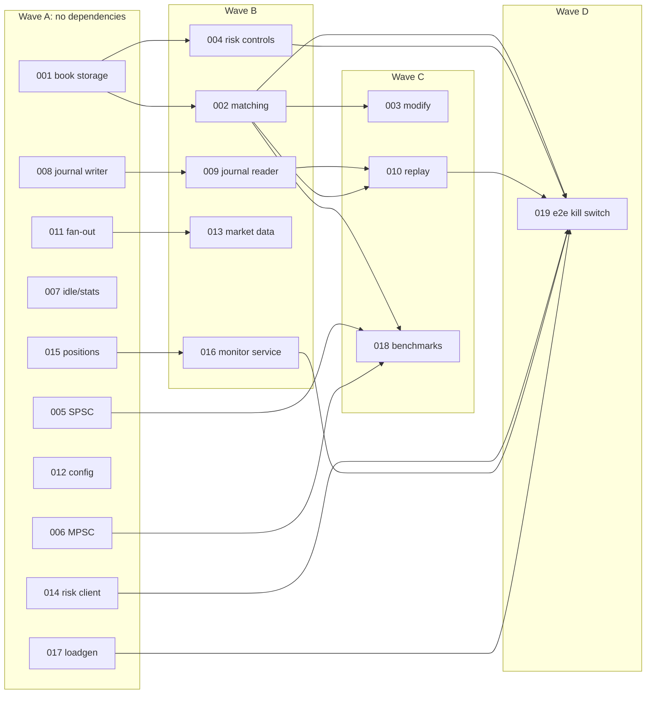

# Task backlog

Each file in this directory is a **self-contained spec** for one unit of work,
written to be executed by an engineer or an LLM agent that sees only this
repository. The workflow is in [docs/ai-workflow.md](../ai-workflow.md); the
rules every task must follow are in [CLAUDE.md](../../CLAUDE.md).

Every spec has the same sections: **Goal · Context · Interfaces to implement ·
Acceptance criteria · Files expected to change · Out of scope · Dependencies**.
A task is done when its acceptance criteria pass *and* the repository-wide
definition of done in CLAUDE.md holds.

## Tasks

| # | Task | Layer | Hard deps | Wave |
|---|---|---|---|---|
| [001](001-order-book-storage.md) | Order book storage: pooled FIFO levels, O(1) cancel | domain | – | A |
| [002](002-matching-limit-market.md) | Price-time matching for limit and market orders | domain | 001 | B |
| [003](003-cancel-modify-duplicates.md) | Modify (cancel/replace) and duplicate client ids | domain | 002 | C |
| [004](004-risk-controls-in-domain.md) | Risk controls: block, kill switch, link policy | domain | 001 | B |
| [005](005-spsc-queue.md) | Lock-free SPSC queue | concurrency | – | A |
| [006](006-mpsc-queue.md) | Lock-free bounded MPSC queue | concurrency | – | A |
| [007](007-runtime-idle-and-stats.md) | Parking idle strategy, wake-ups, runtime stats | app | – | A |
| [008](008-journal-writer.md) | Journal record codec, CRC32C, file writer | adapters/journal | – | A |
| [009](009-journal-reader.md) | Lazy journal reader (`std::generator`), recovery, fuzzer | adapters/journal | 008 | B |
| [010](010-deterministic-replay.md) | File-based replay tool and full determinism suite | app, tests | 002, 008, 009 | C |
| [011](011-publisher-fanout.md) | Publisher subscriptions with slow-consumer policy | app | – | A |
| [012](012-instrument-config.md) | Instrument reference data and config file | adapters/config, main | – | A |
| [013](013-grpc-market-data.md) | `MarketDataService.Subscribe` | adapters/grpc, codec | 011 | B |
| [014](014-risk-client-adapter.md) | Risk client: reports, ack aggregation, reconnect | adapters/risk_client | – | A |
| [015](015-sentinel-positions-pnl.md) | Sentinel positions, PnL and limit engine | rust/risk-sentinel (lib) | – | A |
| [016](016-sentinel-monitor-service.md) | Sentinel Monitor session logic | rust/risk-sentinel (service) | 015 | B |
| [017](017-loadgen.md) | Load generator: concurrency, rate, scenarios | rust/lockstep-loadgen | – | A |
| [018](018-benchmarks.md) | Benchmarks with latency percentiles | bench | 002, 005, 006 | C |
| [019](019-e2e-kill-switch.md) | End-to-end kill-switch scenario | scripts, CI | 002, 004, 010, 014, 016, 017 | D |
| [020](020-stabilize-idle-park-test.md) | Stabilise the idle-parking test under CPU load | tests/app | – | A |

## Parallel waves

## File ownership (to minimise merge conflicts)

Tasks in the same wave touch disjoint directories, except for the shared
files listed below, where the expected edit is a one-line addition.

| Area | Owned by |
|---|---|
| `domain/**/order_book.*` | 001, then 002/003/004 (sequential) |
| `domain/**/matching.*` | 002 |
| `domain/**/risk_state.*` | 004 |
| `concurrency/**/spsc_queue.hpp` | 005 |
| `concurrency/**/mpsc_queue.hpp` | 006 |
| `concurrency/**/idle_strategy.hpp`, `app/src/shard_runtime.cpp` | 007 |
| `app/**/publisher.*`, `app/**/subscription.*` | 011 |
| `adapters/journal/**` | 008, then 009 |
| `adapters/config/**` | 012 |
| `adapters/grpc/**/market_data_*`, `adapters/codec/**/market_data_*` | 013 |
| `adapters/risk_client/**`, `adapters/codec/**/risk_*` | 014 |
| `rust/crates/risk-sentinel/src/{positions,limits,engine}.rs` | 015 |
| `rust/crates/risk-sentinel/src/{service,session}.rs` | 016 |
| `rust/crates/lockstep-loadgen/**` | 017 |
| `exchange-core/bench/**` | 018 |
| `tests/app/engine_pipeline_test.cpp` (idle-parking test), `tests/app/test_support.hpp` (wait helper) | 020 |

**Shared, one-line edits** (rebase and resolve trivially):
- `app/include/lockstep/app/queues.hpp`: 005, 006.
- `tests/concurrency/queue_contract_test.cpp` type lists: 005, 006.
- `exchange-core/main/src/main.cpp` wiring: 008, 012, 013, 014.
- `tests/CMakeLists.txt` `add_subdirectory` lines: any task adding a test
  directory.

## Writing a new task

Copy any spec and keep every section. A spec is good when an agent with no
access to this conversation could implement it and a reviewer could verify it
using only the acceptance criteria.
